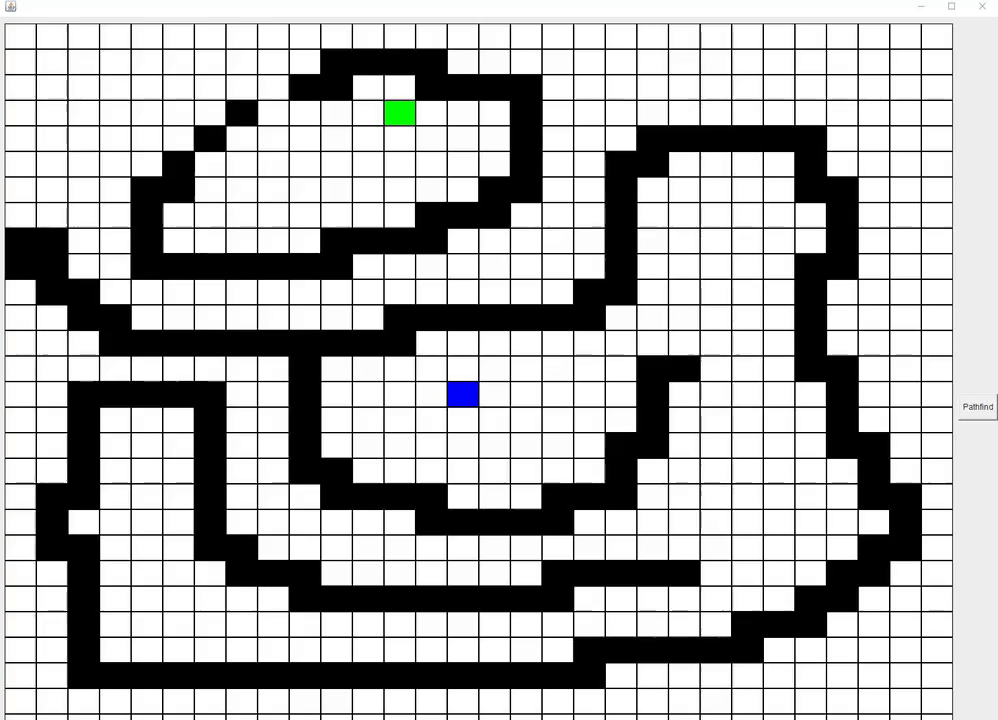

# Pathfinding using a variation of A star algorithm

This program finds the shortest path between two points in the cartesian plane, where there can exist obstacles.

The implmentation first draws a Grid, which then turns it to a node map. (each point in the cartesian plane is a unique node). 
Each node is dedicated a value with a number that represents the distance between the node and the goal.
During running time, the distance to each node is calculated. Assuming that we can only step to adjacent 
blocks (8 directions), we know that the distance to the neigbours can either be 1 or 
approximately 1.41 units depending if its diagonal neighbour or not.
With the information about the node and edge, we always choose the lowest value path, and expand that branch, and update 
the edges. Where  we eventually reach the goal. Since we always choose the lowest value path to branch out, when we reached the goal, 
we therefore have the lowest value path, i.e the shortest path to the goal. 

Solving this problem we used a min-heap (priority que in java) to effiecntly access the lowest value node. 
And a list of visited nodes, so we dont go to nodes that we already determined.

Note for users: Use mouse leftclick to create obstacles, use Mouse right click to remove.  

# Comments about the code 
Coupling is can be reduced,   and cohesion can be improved by creating an class for the Each marker (goal,player,empty...etc) . The program was firstly designed for only console implmentation and then eventually got expanded into a gui solution
